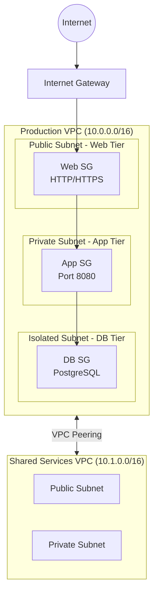

# VPC Networking Lab

## Overview

This hands-on lab demonstrates advanced VPC networking concepts essential for the AWS Solutions Architect Professional exam. You'll create a multi-VPC architecture with VPC peering, learn about security group layering, and practice route table configuration.

**Difficulty:** Intermediate
**Estimated Time:** 45-60 minutes
**Estimated Cost:** ~$0.10/hour (~$0.50 for full lab)

## Learning Objectives

By completing this lab, you will:

1. Design and implement a multi-tier VPC architecture
2. Configure VPC peering between two VPCs
3. Implement layered security using security groups
4. Understand route table configuration for VPC peering
5. Apply Network ACLs for subnet-level security
6. Practice AWS networking best practices

## Architecture

This lab creates the following architecture:



## Prerequisites

- AWS Account with administrative access
- AWS CLI configured
- Node.js and pnpm installed
- Understanding of VPC basics (subnets, route tables, security groups)

## Cost Breakdown

| Resource | Cost (approx.) |
|----------|---------------|
| NAT Gateway (1) | $0.045/hour |
| Data processing | $0.045/GB |
| VPC Peering (data transfer) | Free (same region) |
| **Total** | **~$0.10/hour** |

**💰 Important:** Remember to destroy resources after completing the lab to avoid ongoing charges!

## Deployment

### Step 1: Deploy the Infrastructure

Click the **Deploy Lab** button above, or run:

```bash
pnpm cdk:deploy lab-vpc-networking
```

Deployment takes approximately 5-7 minutes.

### Step 2: Verify Deployment

Once deployment completes, you'll see CloudFormation outputs including:

- VPC IDs for both VPCs
- Subnet IDs (public, private, isolated)
- Security Group IDs
- VPC Peering Connection ID
- Console URLs for quick access

## Lab Exercises

### Exercise 1: Explore VPC Configuration

**Objective:** Understand VPC structure and CIDR allocation

1. Navigate to the **VPC Console** using the provided console URL
2. Examine the Production VPC (10.0.0.0/16):
   - How many subnets are created?
   - What are the CIDR blocks for each subnet?
   - Which subnets are in which Availability Zones?

3. Review the Shared Services VPC (10.1.0.0/16):
   - Compare subnet configuration with Production VPC
   - Why doesn't this VPC have a NAT Gateway?

**Key Concept:** VPC CIDR planning is crucial. The /16 gives 65,536 IPs, and /24 subnets provide 256 IPs each (251 usable).

### Exercise 2: Analyze Route Tables

**Objective:** Understand routing for VPC peering

1. Open the **Route Tables** section in VPC Console
2. Find the route table for Production VPC private subnets:
   - What is the local route?
   - What route was added for VPC peering?
   - Where does traffic to 10.1.0.0/16 go?

3. Test route configuration:
   - What happens if you remove the peering route?
   - How would you route traffic to the internet from private subnets?

**Key Concept:** Route tables determine where network traffic is directed. VPC peering requires routes in both VPCs.

### Exercise 3: Security Group Layering

**Objective:** Implement defense-in-depth with security groups

1. Navigate to **Security Groups** in VPC Console
2. Examine the Web tier security group:
   - What inbound rules exist?
   - From where can traffic originate?

3. Check the App tier security group:
   - What's the source of allowed traffic?
   - Why reference the Web SG instead of CIDR blocks?

4. Review the Database tier security group:
   - How is this more restrictive than App tier?
   - What happens if you try to access the database from the web tier directly?

**Key Concept:** Referencing security groups in rules creates dynamic, maintainable security. When instances are added to the Web SG, they automatically gain access to App tier.

### Exercise 4: Network ACLs vs Security Groups

**Objective:** Understand stateless vs stateful filtering

1. Find the custom Network ACL on the public subnet
2. Compare NACL rules to Security Group rules:
   - Why do NACLs need explicit outbound rules?
   - Why allow ephemeral ports (1024-65535)?
   - What's the difference between ALLOW and DENY?

3. Test NACL behavior:
   - Try adding a DENY rule for a specific IP
   - Observe rule number priority

**Key Concept:** NACLs are stateless (return traffic must be explicitly allowed). Security Groups are stateful (return traffic is automatically allowed).

### Exercise 5: VPC Peering

**Objective:** Understand cross-VPC connectivity

1. Navigate to **Peering Connections** in VPC Console
2. Verify the peering connection status (should be "Active")
3. Check route tables in both VPCs:
   - Do both VPCs have routes to each other?
   - What's the target of these routes?

4. Understand limitations:
   - Can VPC peering work across regions?
   - What if CIDR blocks overlap?
   - Is VPC peering transitive?

**Key Concept:** VPC peering is non-transitive. If VPC A peers with VPC B, and VPC B peers with VPC C, VPC A cannot reach VPC C without a direct peering connection.

### Exercise 6: Multi-Tier Architecture Design

**Objective:** Apply security best practices

1. Review the three-tier security group setup:
   ```
   Internet → Web SG → App SG → DB SG
   ```

2. Consider the security benefits:
   - Principle of least privilege
   - Blast radius reduction
   - Defense in depth

3. Think about improvements:
   - How would you add a bastion host for SSH access?
   - Where would you place a load balancer?
   - How would you implement database replication across AZs?

**Key Concept:** Multi-tier architectures separate concerns and limit damage if one layer is compromised.

## Validation

Verify your understanding by answering these questions:

- [ ] Can you explain the difference between 0.0.0.0/0 and VPC CIDR in route tables?
- [ ] Why are there separate public and private subnets?
- [ ] What's the purpose of the NAT Gateway?
- [ ] How does VPC peering differ from Transit Gateway?
- [ ] When would you use NACLs instead of (or in addition to) Security Groups?

## Cleanup

**Important:** Destroy resources to avoid charges!

Click the **Cleanup Lab** button above, or run:

```bash
pnpm cdk:destroy lab-vpc-networking
```

Verify in CloudFormation console that the stack is fully deleted.

## Additional Challenges

If you want to extend this lab:

1. **Add a Transit Gateway** to connect both VPCs (instead of peering)
2. **Deploy test EC2 instances** in each tier to verify connectivity
3. **Implement VPC Flow Logs** to capture traffic for analysis
4. **Add a third VPC** and practice transitive routing with Transit Gateway
5. **Create VPC endpoints** for S3 and DynamoDB access without NAT Gateway

## Related Exam Topics

This lab covers SAP-C02 exam topics:

- **Domain 1:** Multi-account VPC design, network connectivity
- **Domain 2:** VPC architecture for new workloads
- **Exam Task 1.3:** Design network connectivity strategies

## Related Study Content

- [Network Connectivity Strategies](/study/domain-1-organizational-complexity/network-connectivity)
- [Networking Solutions for New Workloads](/study/domain-2-new-workloads/networking-solutions)

## Troubleshooting

**Issue:** VPC peering connection stuck in "pending-acceptance"
**Solution:** Check that both VPCs are in the same account. For same-account peering, acceptance is automatic.

**Issue:** Cannot access resources in peered VPC
**Solution:** Verify route tables have been updated in BOTH VPCs with peering connection as target.

**Issue:** NAT Gateway charges seem high
**Solution:** This lab uses 1 NAT Gateway for cost savings. Production would use 1 per AZ for high availability.

## Learn More

- [AWS VPC Documentation](https://docs.aws.amazon.com/vpc/latest/userguide/)
- [VPC Peering Guide](https://docs.aws.amazon.com/vpc/latest/peering/)
- [Security Group Best Practices](https://docs.aws.amazon.com/vpc/latest/userguide/VPC_SecurityGroups.html)
- [Network ACLs](https://docs.aws.amazon.com/vpc/latest/userguide/vpc-network-acls.html)

---

**Lab ID:** lab-vpc-networking
**Version:** 1.0.0
**Last Updated:** 2026-01-05
