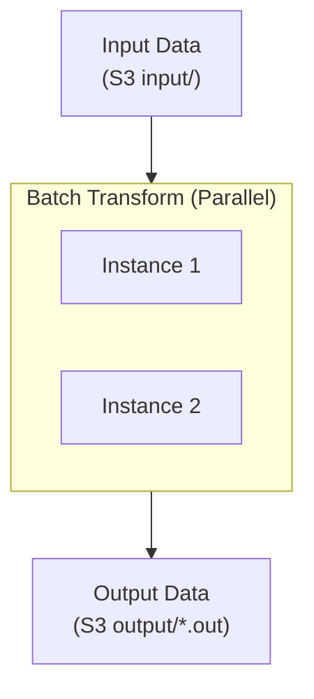

# SageMaker Batch Transform Lab

## Overview

This lab covers SageMaker Batch Transform for large-scale offline inference. You'll learn to process datasets efficiently, configure data splitting, and integrate batch predictions into data pipelines.

**Difficulty:** Intermediate
**Estimated Time:** 45-60 minutes
**Estimated Cost:** ~$0.05/hour (infrastructure) + batch job costs

## Learning Objectives

By completing this lab, you will:

1. Configure batch transform jobs
2. Understand data splitting strategies
3. Use input/output filters with JSONPath
4. Implement join source for ID correlation
5. Optimize batch processing performance
6. Integrate with ML pipelines

## Architecture



## Cost Breakdown

| Resource | Cost (approx.) |
|----------|---------------|
| ml.m5.large | $0.115/hour |
| ml.m5.xlarge | $0.23/hour |
| S3 Storage | ~$0.023/GB/month |
| **Typical job** | **~$0.50-2.00** |

## Deployment

```bash
pnpm cdk:deploy lab-batch-transform
```

## Lab Exercises

### Exercise 1: Create a Batch Transform Job

**Objective:** Run inference on a dataset

```python
from sagemaker.xgboost import XGBoostModel

model = XGBoostModel(
    model_data=f"s3://{bucket}/models/model.tar.gz",
    role=role,
    framework_version="1.5-1",
)

transformer = model.transformer(
    instance_count=2,
    instance_type="ml.m5.large",
    output_path=f"s3://{bucket}/output/",
    assemble_with="Line",
    accept="text/csv",
)

transformer.transform(
    data=f"s3://{bucket}/input/",
    content_type="text/csv",
    split_type="Line",
    wait=True,
)
```

### Exercise 2: Configure Data Splitting

**Objective:** Understand split types

| SplitType | Description | Use Case |
|-----------|-------------|----------|
| None | One inference per file | Large single records |
| Line | Split by newlines | CSV, JSON Lines |
| RecordIO | Split by RecordIO | Optimized format |
| TFRecord | Split by TFRecord | TensorFlow data |

```python
transformer.transform(
    data=input_path,
    split_type="Line",        # Split CSV by lines
    content_type="text/csv",
)
```

### Exercise 3: Use Data Processing Filters

**Objective:** Transform input/output with JSONPath

```python
transformer.transform(
    data=input_path,
    content_type="text/csv",
    split_type="Line",
    # Skip first column (ID) for inference
    input_filter="$[1:]",
    # Include ID with prediction
    output_filter="$[0,-1]",
    # Merge predictions with input
    join_source="Input",
)
```

Example:
- Input: `id,feature1,feature2,feature3`
- After input_filter: `feature1,feature2,feature3`
- Model output: `prediction`
- After join + output_filter: `id,prediction`

### Exercise 4: Optimize Performance

**Objective:** Tune batch processing

```python
transformer = model.transformer(
    instance_count=4,              # More instances
    instance_type="ml.m5.xlarge",  # Larger instances
    strategy="MultiRecord",         # Batch records
    max_payload=6,                  # MB per mini-batch
    max_concurrent_transforms=4,   # Parallel processing
)
```

Performance factors:
- `instance_count`: Horizontal scaling
- `strategy`: SingleRecord vs MultiRecord
- `max_concurrent_transforms`: Parallelism per instance
- `max_payload`: Batch size in MB

### Exercise 5: Handle Large Files

**Objective:** Process multi-GB datasets

```python
# For large files, increase resources
transformer = model.transformer(
    instance_count=10,
    instance_type="ml.m5.2xlarge",
    volume_size_in_gb=50,  # Larger disk
    max_concurrent_transforms=8,
)

# Split input into multiple files for parallelism
# s3://bucket/input/
#   - part-00000.csv
#   - part-00001.csv
#   - ...
```

### Exercise 6: Monitor Batch Job

**Objective:** Track job progress

```python
# Check job status
transformer.wait()

# Get job details
import boto3
sm = boto3.client("sagemaker")

response = sm.describe_transform_job(
    TransformJobName=transformer.latest_transform_job.name
)
print(f"Status: {response['TransformJobStatus']}")
print(f"Records processed: {response.get('TransformOutput', {})}")
```

## Validation

- [ ] When should you use batch transform vs real-time endpoints?
- [ ] How does MultiRecord strategy improve performance?
- [ ] What's the purpose of join_source?
- [ ] How do you correlate predictions with input IDs?

## Cleanup

```bash
pnpm cdk:destroy lab-batch-transform
```

## Related Exam Topics

- **Domain 3:** Deployment and Orchestration
- **Task 3.1:** Select deployment infrastructure

## Learn More

- [Batch Transform Documentation](https://docs.aws.amazon.com/sagemaker/latest/dg/batch-transform.html)
- [Data Processing Options](https://docs.aws.amazon.com/sagemaker/latest/dg/batch-transform-data-processing.html)

---

**Lab ID:** lab-batch-transform
**Version:** 1.0.0
**Last Updated:** 2026-01-14
