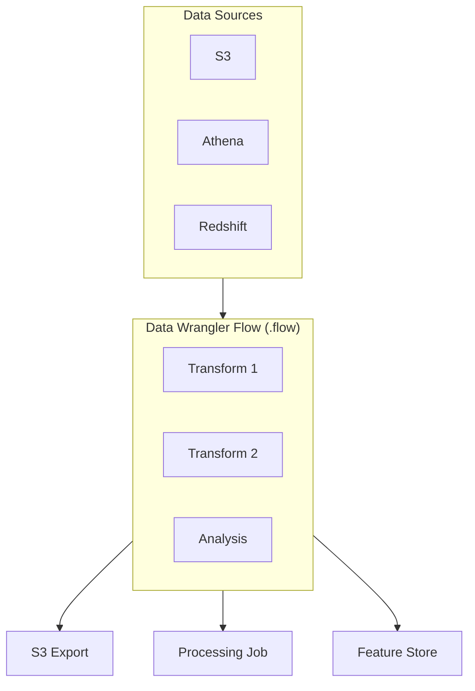

# SageMaker Data Wrangler Lab

## Overview

This lab introduces SageMaker Data Wrangler for visual data preparation. You'll create data flows, apply transformations, analyze data quality, and export processed data for ML training - all without writing code.

**Difficulty:** Beginner
**Estimated Time:** 60-90 minutes
**Estimated Cost:** ~$0.27/hour when Data Wrangler app running

## Learning Objectives

By completing this lab, you will:

1. Create Data Wrangler flows in SageMaker Studio
2. Import data from S3 and other sources
3. Apply built-in transformations
4. Analyze data quality and distributions
5. Detect target leakage
6. Export flows to Processing jobs

## Architecture



## Prerequisites

- SageMaker Studio Domain (deploy lab-sagemaker-studio first)
- Sample CSV data in S3

## Cost Breakdown

| Resource | Cost (approx.) |
|----------|---------------|
| Data Wrangler App | ~$0.27/hour (ml.m5.4xlarge minimum) |
| S3 Storage | ~$0.023/GB/month |
| Processing Jobs | Varies by instance |
| **Total** | **~$0.27/hour** |

**Important:** Shut down Data Wrangler when not in use!

## Deployment

```bash
pnpm cdk:deploy lab-data-wrangler
```

## Lab Exercises

### Exercise 1: Create a New Data Flow

**Objective:** Start a Data Wrangler project

1. Open SageMaker Studio
2. File > New > Data Wrangler Flow
3. Name your flow: "customer-churn-prep"

### Exercise 2: Import Data

**Objective:** Load data from S3

1. Click "Import data"
2. Select "Amazon S3"
3. Navigate to the lab S3 bucket
4. Upload sample data (or use existing)
5. Preview and confirm schema

### Exercise 3: Data Profiling

**Objective:** Understand data quality

1. Click on the data node
2. Select "Add analysis"
3. Choose "Data Quality and Insights Report"
4. Review:
   - Missing values
   - Duplicate rows
   - Data type recommendations
   - Feature correlations

### Exercise 4: Apply Transformations

**Objective:** Clean and transform data

1. Click "+" to add a transform step
2. Try these transformations:

**Handle Missing Values:**
- Select "Handle missing" > "Fill missing"
- Choose imputation strategy (mean, median, mode)

**Encode Categorical:**
- Select "Encode categorical"
- Choose one-hot or ordinal encoding

**Normalize Numeric:**
- Select "Process numeric"
- Apply min-max or z-score normalization

### Exercise 5: Detect Target Leakage

**Objective:** Identify problematic features

1. Add analysis step
2. Select "Target Leakage"
3. Configure:
   - Target column: your label column
   - Problem type: Classification
4. Review flagged features

### Exercise 6: Export for Training

**Objective:** Generate processing job

1. Click "Export"
2. Choose "Data" > "SageMaker Processing"
3. Configure job settings:
   - Instance type: ml.m5.large
   - Instance count: 1
4. Export and run

## Validation

- [ ] What transformations are most useful for your data type?
- [ ] How does Data Wrangler differ from AWS Glue DataBrew?
- [ ] When would you export to Feature Store vs S3?
- [ ] How do you handle imbalanced datasets in Data Wrangler?

## Cleanup

1. First, shut down Data Wrangler app in Studio
2. Then run:

```bash
pnpm cdk:destroy lab-data-wrangler
```

## Related Exam Topics

- **Domain 1:** Data preparation for ML
- **Task 1.2:** Transform data and perform feature engineering
- **Task 1.3:** Ensure data integrity

## Learn More

- [SageMaker Data Wrangler Documentation](https://docs.aws.amazon.com/sagemaker/latest/dg/data-wrangler.html)
- [Data Wrangler Transformations](https://docs.aws.amazon.com/sagemaker/latest/dg/data-wrangler-transform.html)

---

**Lab ID:** lab-data-wrangler
**Version:** 1.0.0
**Last Updated:** 2026-01-14
