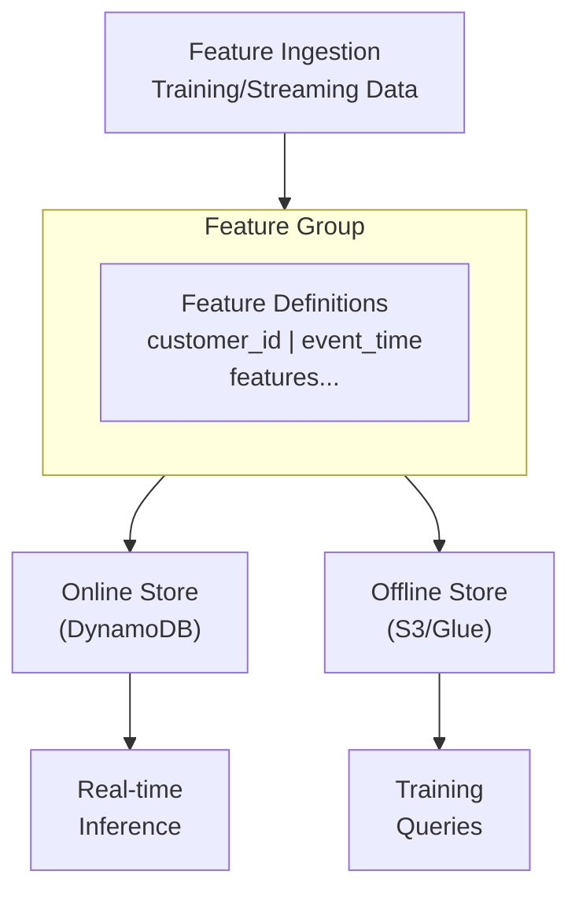

# SageMaker Feature Store Lab

## Overview

This lab demonstrates SageMaker Feature Store for centralized feature management in ML workflows. You'll create feature groups, understand online and offline stores, and practice feature ingestion and retrieval patterns essential for production ML systems.

**Difficulty:** Intermediate
**Estimated Time:** 45-60 minutes
**Estimated Cost:** ~$0.01/hour

## Learning Objectives

By completing this lab, you will:

1. Create and configure Feature Groups
2. Define feature schemas with appropriate data types
3. Configure online stores for low-latency inference
4. Set up offline stores with S3 and Glue Data Catalog
5. Ingest features using the Python SDK
6. Query offline features with Athena

## Architecture



## Prerequisites

- AWS Account with administrative access
- AWS CLI configured
- Familiarity with SageMaker basics

## Cost Breakdown

| Resource | Cost (approx.) |
|----------|---------------|
| Online Store | $0.18/GB storage/month |
| Offline Store | S3 storage costs |
| Glue Data Catalog | Free (first 1M objects) |
| Read/Write units | Pay per request |
| **Total** | **~$0.01/hour** |

## Deployment

```bash
pnpm cdk:deploy lab-feature-store
```

## Lab Exercises

### Exercise 1: Explore Feature Groups

**Objective:** Understand Feature Group structure

1. Open SageMaker Console > Feature Store
2. Examine the created feature groups:
   - Customer Features (demographics)
   - Transaction Features (aggregations)

3. Note the configuration:
   - Record identifier feature
   - Event time feature
   - Online/offline store settings

### Exercise 2: Ingest Features

**Objective:** Add records to a Feature Group

```python
import sagemaker
from sagemaker.feature_store.feature_group import FeatureGroup
import time

session = sagemaker.Session()
customer_fg = FeatureGroup(
    name='mla-study-customer-features',
    sagemaker_session=session
)

# Ingest a record
record = [
    {"FeatureName": "customer_id", "ValueAsString": "C001"},
    {"FeatureName": "event_time", "ValueAsString": str(time.time())},
    {"FeatureName": "age", "ValueAsString": "35"},
    {"FeatureName": "income", "ValueAsString": "75000.0"},
    {"FeatureName": "credit_score", "ValueAsString": "720"},
    {"FeatureName": "account_tenure_months", "ValueAsString": "24"},
    {"FeatureName": "num_products", "ValueAsString": "3"},
    {"FeatureName": "is_active", "ValueAsString": "1"},
    {"FeatureName": "customer_segment", "ValueAsString": "premium"},
]
customer_fg.put_record(record)
```

### Exercise 3: Retrieve Online Features

**Objective:** Get features for real-time inference

```python
# Get record from online store
record = customer_fg.get_record(
    record_identifier_value_as_string="C001"
)
print(record)
```

### Exercise 4: Query Offline Store

**Objective:** Query features with Athena

1. Wait ~15 minutes for offline store sync
2. Open Athena Console
3. Select the Glue database created by the lab
4. Run a query:

```sql
SELECT *
FROM "mla_study_feature_store"."customer_features"
WHERE customer_id = 'C001'
ORDER BY event_time DESC
LIMIT 10;
```

### Exercise 5: Feature Joining for Training

**Objective:** Join multiple feature groups

```sql
SELECT
    c.customer_id,
    c.age,
    c.income,
    c.credit_score,
    t.avg_transaction_amount_30d,
    t.num_transactions_30d,
    t.total_spend_30d
FROM "mla_study_feature_store"."customer_features" c
JOIN "mla_study_feature_store"."transaction_features" t
    ON c.customer_id = t.customer_id
    AND c.event_time = t.event_time
```

## Validation

- [ ] Can you explain the difference between online and offline stores?
- [ ] Why is event_time important for Feature Store?
- [ ] How does Feature Store handle feature versioning?
- [ ] When would you use point-in-time joins?

## Cleanup

```bash
pnpm cdk:destroy lab-feature-store
```

## Related Exam Topics

- **Domain 1:** Feature engineering and data preparation
- **Task 1.2:** Transform data and perform feature engineering

## Learn More

- [SageMaker Feature Store Documentation](https://docs.aws.amazon.com/sagemaker/latest/dg/feature-store.html)
- [Feature Store Best Practices](https://docs.aws.amazon.com/sagemaker/latest/dg/feature-store-getting-started.html)

---

**Lab ID:** lab-feature-store
**Version:** 1.0.0
**Last Updated:** 2026-01-14
