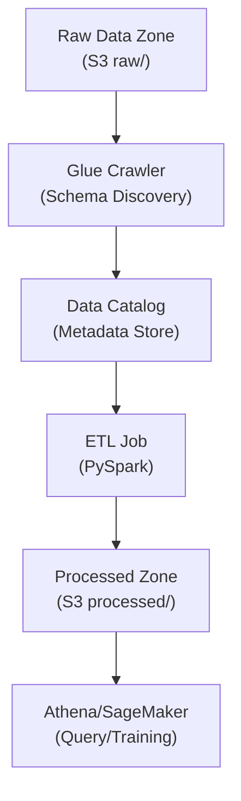

# AWS Glue ETL Lab for ML Data Preparation

## Overview

This lab demonstrates AWS Glue for large-scale data preparation in ML pipelines. You'll create crawlers, ETL jobs, and learn data lake patterns essential for production ML data engineering.

**Difficulty:** Intermediate
**Estimated Time:** 60-75 minutes
**Estimated Cost:** ~$0.44/hour when jobs running

## Learning Objectives

By completing this lab, you will:

1. Create and configure Glue Crawlers
2. Build ETL jobs with PySpark
3. Manage schema with Glue Data Catalog
4. Implement data lake patterns (raw/processed zones)
5. Configure job bookmarks for incremental processing
6. Query results with Athena

## Architecture



## Prerequisites

- AWS Account with administrative access
- Basic understanding of SQL and data transformation

## Cost Breakdown

| Resource | Cost (approx.) |
|----------|---------------|
| Glue Crawler | $0.44/DPU-hour |
| Glue ETL Job | $0.44/DPU-hour (min 2 DPUs) |
| S3 Storage | ~$0.023/GB/month |
| Data Catalog | Free (first 1M objects) |
| **Total** | **~$0.44/hour when running** |

## Deployment

```bash
pnpm cdk:deploy lab-glue-etl
```

## Lab Exercises

### Exercise 1: Explore Data Lake Structure

**Objective:** Understand the data lake organization

1. Open S3 Console
2. Navigate to the lab bucket
3. Explore the folder structure:
   - `raw/` - Incoming data
   - `processed/` - Transformed data
   - `scripts/` - ETL scripts

### Exercise 2: Run the Crawler

**Objective:** Discover data schema automatically

1. Open AWS Glue Console
2. Navigate to Crawlers
3. Select the raw data crawler
4. Click "Run crawler"
5. Wait for completion (1-2 minutes)
6. Check the Data Catalog for new tables

### Exercise 3: Examine the ETL Job

**Objective:** Understand the PySpark transformation

Review the ETL job script components:

```python
# Key transformations in the ETL job:

# 1. Handle missing values
cleaned_df = raw_df.na.fill({
    'numeric_col': 0,
    'string_col': 'unknown'
})

# 2. Remove duplicates
deduped_df = cleaned_df.dropDuplicates(['id'])

# 3. Normalize features
normalized_df = deduped_df.withColumn(
    'feature_normalized',
    (col('feature') - mean) / stddev
)

# 4. Create derived features
final_df = normalized_df.withColumn(
    'feature_ratio',
    col('feature1') / col('feature2')
)
```

### Exercise 4: Run the ETL Job

**Objective:** Execute data transformation

```bash
aws glue start-job-run --job-name mla-study-ml-data-etl
```

Monitor progress in the Glue Console.

### Exercise 5: Query Results with Athena

**Objective:** Verify transformed data

1. Open Athena Console
2. Select the Glue database
3. Run queries:

```sql
-- Check processed data
SELECT * FROM processed_data LIMIT 10;

-- Verify data quality
SELECT
    COUNT(*) as total_rows,
    COUNT(DISTINCT id) as unique_ids,
    AVG(feature_normalized) as avg_normalized
FROM processed_data;
```

### Exercise 6: Configure Incremental Processing

**Objective:** Set up job bookmarks

1. Open the ETL job in Glue Console
2. Edit job properties
3. Enable "Job bookmark"
4. Test with new data in raw/ folder

## Validation

- [ ] Can you explain the difference between Glue Crawler and ETL Job?
- [ ] What are job bookmarks and when would you use them?
- [ ] How does Glue integrate with SageMaker training?
- [ ] When would you choose Glue over Data Wrangler?

## Cleanup

```bash
pnpm cdk:destroy lab-glue-etl
```

## Related Exam Topics

- **Domain 1:** Data ingestion and storage
- **Task 1.1:** Ingest and store data
- **Task 1.2:** Transform data

## Learn More

- [AWS Glue Developer Guide](https://docs.aws.amazon.com/glue/latest/dg/what-is-glue.html)
- [Glue ETL Programming](https://docs.aws.amazon.com/glue/latest/dg/aws-glue-programming.html)
- [Glue Job Bookmarks](https://docs.aws.amazon.com/glue/latest/dg/monitor-continuations.html)

---

**Lab ID:** lab-glue-etl
**Version:** 1.0.0
**Last Updated:** 2026-01-14
