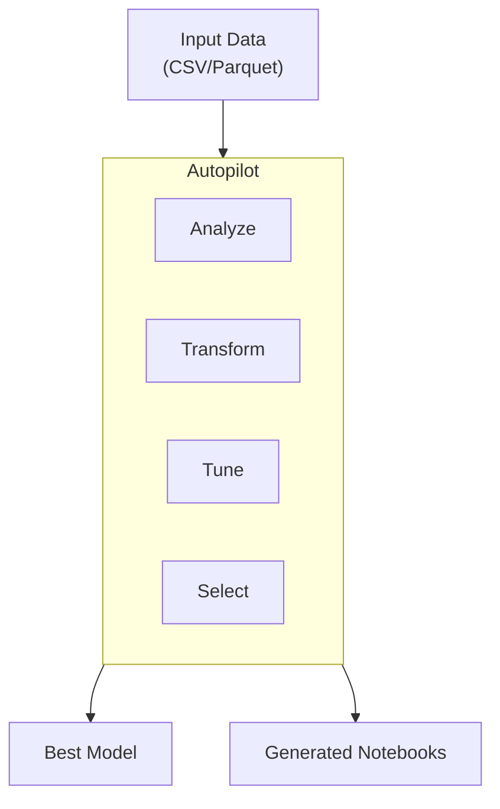

# SageMaker Autopilot Lab (AutoML)

## Overview

This lab explores SageMaker Autopilot for automated machine learning. You'll create AutoML jobs, understand the generated notebooks, and learn when to use Autopilot vs manual model development.

**Difficulty:** Beginner
**Estimated Time:** 90-120 minutes
**Estimated Cost:** ~$0.05/hour (infrastructure) + AutoML job costs

## Learning Objectives

By completing this lab, you will:

1. Create Autopilot jobs for tabular data
2. Understand problem type selection
3. Analyze generated data exploration notebooks
4. Review candidate pipelines and models
5. Deploy the best Autopilot model
6. Extract and customize generated code

## Architecture



## Prerequisites

- Tabular dataset (CSV with headers)
- At least 500 rows of data
- Clear target column

## Cost Breakdown

| Resource | Cost (approx.) |
|----------|---------------|
| Autopilot Job | Varies by data size |
| Training instances | ~$0.05-0.20/candidate |
| Typical job (10 candidates) | ~$5-20 total |
| S3 Storage | ~$0.023/GB/month |

## Deployment

```bash
pnpm cdk:deploy lab-sagemaker-autopilot
```

## Lab Exercises

### Exercise 1: Prepare Your Dataset

**Objective:** Format data for Autopilot

Requirements:
- CSV format with header row
- Target column clearly identified
- No missing target values
- Minimum 500 rows

```bash
# Upload data
aws s3 cp customer_churn.csv s3://your-bucket/data/input/
```

### Exercise 2: Create Autopilot Job

**Objective:** Launch an AutoML experiment

```python
from sagemaker.automl.automl import AutoML

automl = AutoML(
    role=role,
    target_attribute_name="churn",
    output_path=f"s3://{bucket}/output/",
    problem_type="BinaryClassification",
    max_candidates=10,
    max_runtime_per_training_job_in_seconds=1800,
    total_job_runtime_in_seconds=7200,
    mode="ENSEMBLING",  # or "HYPERPARAMETER_TUNING"
)

automl.fit(
    inputs=f"s3://{bucket}/data/input/train.csv",
    job_name="customer-churn-autopilot",
    wait=False,
)
```

### Exercise 3: Monitor Job Progress

**Objective:** Track Autopilot stages

```python
# Check job status
automl.describe_auto_ml_job()

# List candidates as they're generated
candidates = automl.list_candidates()
for candidate in candidates[:5]:
    print(f"Candidate: {candidate['CandidateName']}")
    print(f"  Status: {candidate['CandidateStatus']}")
    print(f"  Objective: {candidate.get('FinalAutoMLJobObjectiveMetric', {})}")
```

### Exercise 4: Explore Generated Notebooks

**Objective:** Understand Autopilot's decisions

1. Navigate to S3 output path
2. Find generated notebooks:
   - **Data Exploration**: Statistics, visualizations
   - **Candidate Definition**: Pipeline configurations

3. Review key insights:
   - Feature transformations applied
   - Algorithms explored
   - Hyperparameter ranges

### Exercise 5: Compare Autopilot Modes

**Objective:** Understand ENSEMBLING vs HPO

| Mode | Description | Best For |
|------|-------------|----------|
| ENSEMBLING | Multiple models combined | Best accuracy |
| HYPERPARAMETER_TUNING | Single algorithm tuned | Faster, simpler |

```python
# Ensembling mode (default)
automl_ensemble = AutoML(
    mode="ENSEMBLING",
    # Uses XGBoost, LightGBM, CatBoost, etc.
)

# HPO mode
automl_hpo = AutoML(
    mode="HYPERPARAMETER_TUNING",
    # Focuses on one algorithm type
)
```

### Exercise 6: Deploy Best Model

**Objective:** Create inference endpoint

```python
# Get best candidate
best_candidate = automl.best_candidate()
print(f"Best model: {best_candidate['CandidateName']}")

# Deploy
predictor = automl.deploy(
    initial_instance_count=1,
    instance_type="ml.m5.large",
)

# Make predictions
import pandas as pd
test_data = pd.read_csv("test.csv")
predictions = predictor.predict(test_data.values)
```

## Validation

- [ ] What problem types does Autopilot support?
- [ ] How does Autopilot handle categorical features?
- [ ] When would you choose HPO mode over Ensembling?
- [ ] How can you use Autopilot's generated code in your own pipeline?

## Cleanup

```bash
# Delete endpoint first
predictor.delete_endpoint()

# Then destroy infrastructure
pnpm cdk:destroy lab-sagemaker-autopilot
```

## Related Exam Topics

- **Domain 2:** ML Model Development
- **Task 2.1:** Choose a modeling approach

## Learn More

- [SageMaker Autopilot Documentation](https://docs.aws.amazon.com/sagemaker/latest/dg/autopilot-automate-model-development.html)
- [Autopilot Problem Types](https://docs.aws.amazon.com/sagemaker/latest/dg/autopilot-problem-types.html)

---

**Lab ID:** lab-sagemaker-autopilot
**Version:** 1.0.0
**Last Updated:** 2026-01-14
