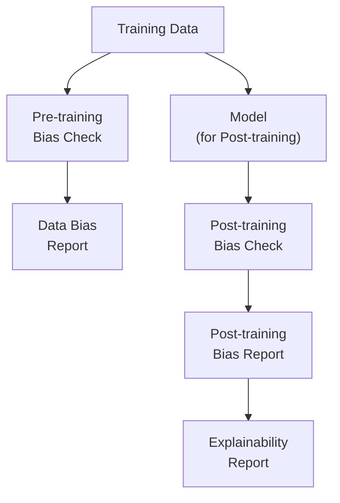

# SageMaker Clarify Lab - Bias Detection and Explainability

## Overview

This lab covers SageMaker Clarify for bias detection and model explainability. You'll analyze training data for bias, evaluate model fairness, and generate SHAP-based feature importance reports.

**Difficulty:** Advanced
**Estimated Time:** 75-90 minutes
**Estimated Cost:** ~$0.12/hour when jobs running

## Learning Objectives

By completing this lab, you will:

1. Detect pre-training bias in datasets
2. Analyze post-training bias in predictions
3. Generate model explainability with SHAP
4. Understand bias metrics and thresholds
5. Create compliance-ready reports
6. Integrate Clarify with ML pipelines

## Architecture



## Cost Breakdown

| Resource | Cost (approx.) |
|----------|---------------|
| Clarify Processing | ~$0.23/hour (ml.m5.xlarge) |
| S3 Storage | ~$0.023/GB/month |
| **Typical job** | **~$0.50-2.00** |

## Deployment

```bash
pnpm cdk:deploy lab-sagemaker-clarify
```

## Lab Exercises

### Exercise 1: Configure Clarify Processor

**Objective:** Set up Clarify for analysis

```python
from sagemaker.clarify import SageMakerClarifyProcessor

clarify_processor = SageMakerClarifyProcessor(
    role=role,
    instance_count=1,
    instance_type="ml.m5.xlarge",
    sagemaker_session=session,
)
```

### Exercise 2: Detect Pre-training Bias

**Objective:** Analyze training data for bias

```python
from sagemaker.clarify import DataConfig, BiasConfig

# Data configuration
data_config = DataConfig(
    s3_data_input_path=f"s3://{bucket}/data/train.csv",
    s3_output_path=f"s3://{bucket}/reports/pre-training-bias/",
    label="target",
    headers=["feature1", "feature2", "gender", "age", "target"],
    dataset_type="text/csv",
)

# Bias configuration
bias_config = BiasConfig(
    label_values_or_threshold=[1],  # Positive outcome
    facet_name="gender",            # Protected attribute
    facet_values_or_threshold=[0],  # Disadvantaged group (e.g., female=0)
)

# Run pre-training bias analysis
clarify_processor.run_pre_training_bias(
    data_config=data_config,
    data_bias_config=bias_config,
    methods=[
        "CI",   # Class Imbalance
        "DPL",  # Difference in Positive Proportions in Labels
        "KL",   # KL Divergence
        "JS",   # Jensen-Shannon Divergence
        "LP",   # L-p Norm
        "TVD",  # Total Variation Distance
        "KS",   # Kolmogorov-Smirnov
        "CDDL", # Conditional Demographic Disparity in Labels
    ],
    wait=True,
)
```

### Exercise 3: Analyze Post-training Bias

**Objective:** Check model predictions for bias

```python
from sagemaker.clarify import ModelConfig, ModelPredictedLabelConfig

# Model configuration
model_config = ModelConfig(
    model_name="your-model-name",
    instance_type="ml.m5.large",
    instance_count=1,
    accept_type="text/csv",
    content_type="text/csv",
)

# Prediction configuration
predictions_config = ModelPredictedLabelConfig(
    probability_threshold=0.5,
)

# Run post-training bias analysis
clarify_processor.run_post_training_bias(
    data_config=data_config,
    data_bias_config=bias_config,
    model_config=model_config,
    model_predicted_label_config=predictions_config,
    methods=[
        "DPPL",  # Difference in Positive Proportions in Predicted Labels
        "DI",    # Disparate Impact
        "DCA",   # Difference in Conditional Acceptance
        "DCR",   # Difference in Conditional Rejection
        "RD",    # Recall Difference
        "DAR",   # Difference in Acceptance Rates
        "DRR",   # Difference in Rejection Rates
        "AD",    # Accuracy Difference
        "TE",    # Treatment Equality
        "FT",    # Flip Test
    ],
    wait=True,
)
```

### Exercise 4: Generate Model Explainability

**Objective:** Compute SHAP feature importance

```python
from sagemaker.clarify import SHAPConfig

shap_config = SHAPConfig(
    baseline=None,              # Auto-generate baseline
    num_samples=500,            # Number of SHAP samples
    agg_method="mean_abs",      # Aggregation method
    use_logit=False,
    save_local_shap_values=True,
)

clarify_processor.run_explainability(
    data_config=data_config,
    model_config=model_config,
    explainability_config=shap_config,
    wait=True,
)
```

### Exercise 5: Interpret Bias Metrics

**Objective:** Understand metric meanings

**Pre-training Metrics:**
| Metric | Range | Fair Value | Description |
|--------|-------|------------|-------------|
| CI | [-1, 1] | ~0 | Class imbalance between groups |
| DPL | [-1, 1] | ~0 | Difference in positive label rate |
| KL | [0, inf] | ~0 | Distribution divergence |

**Post-training Metrics:**
| Metric | Range | Fair Value | Description |
|--------|-------|------------|-------------|
| DI | [0, inf] | ~1 | Ratio of selection rates |
| AD | [-1, 1] | ~0 | Accuracy difference |
| DPPL | [-1, 1] | ~0 | Predicted positive rate difference |

### Exercise 6: Review Reports

**Objective:** Analyze generated reports

```python
import json
import boto3

s3 = boto3.client("s3")

# Download analysis report
s3.download_file(
    bucket,
    "reports/pre-training-bias/analysis.json",
    "analysis.json"
)

with open("analysis.json") as f:
    report = json.load(f)

# Review bias metrics
for facet in report.get("facets", []):
    print(f"Facet: {facet['name']}")
    for metric in facet.get("metrics", []):
        print(f"  {metric['name']}: {metric['value']}")
```

## Validation

- [ ] What's the difference between pre-training and post-training bias?
- [ ] When is Disparate Impact > 1 vs < 1 problematic?
- [ ] How do you choose which bias metrics to prioritize?
- [ ] What does a negative SHAP value indicate?

## Cleanup

```bash
pnpm cdk:destroy lab-sagemaker-clarify
```

## Related Exam Topics

- **Domain 1:** Data quality and bias detection
- **Domain 4:** ML solution security and compliance
- **Task 1.3:** Ensure data integrity

## Learn More

- [SageMaker Clarify Documentation](https://docs.aws.amazon.com/sagemaker/latest/dg/clarify-fairness-and-explainability.html)
- [Bias Detection Guide](https://docs.aws.amazon.com/sagemaker/latest/dg/clarify-detect-data-bias.html)
- [SHAP Explainability](https://docs.aws.amazon.com/sagemaker/latest/dg/clarify-shapley-values.html)

---

**Lab ID:** lab-sagemaker-clarify
**Version:** 1.0.0
**Last Updated:** 2026-01-14
