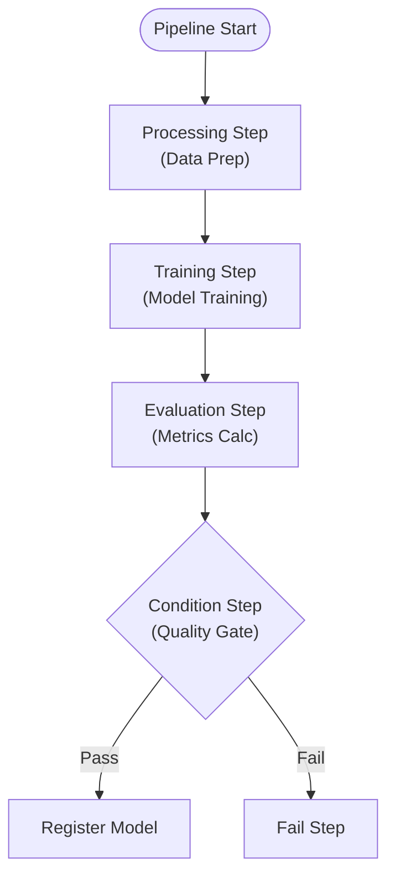

# SageMaker Pipelines Lab

## Overview

This lab covers SageMaker Pipelines for MLOps workflow orchestration. You'll build end-to-end ML pipelines with processing, training, evaluation, and model registration steps.

**Difficulty:** Advanced
**Estimated Time:** 90-120 minutes
**Estimated Cost:** ~$0.05/hour (infrastructure) + pipeline execution costs

## Learning Objectives

By completing this lab, you will:

1. Define ML pipelines with Python SDK
2. Create processing, training, and evaluation steps
3. Implement conditional execution logic
4. Use pipeline parameters for flexibility
5. Enable step caching for efficiency
6. Integrate with Model Registry

## Architecture



## Cost Breakdown

| Resource | Cost (approx.) |
|----------|---------------|
| Processing instances | $0.12/hour |
| Training instances | $0.115/hour |
| S3 Storage | ~$0.023/GB/month |
| **Typical pipeline run** | **~$1-5** |

## Deployment

```bash
pnpm cdk:deploy lab-sagemaker-pipelines
```

## Lab Exercises

### Exercise 1: Create Pipeline Parameters

**Objective:** Make pipelines configurable

```python
from sagemaker.workflow.parameters import (
    ParameterString,
    ParameterInteger,
    ParameterFloat,
)

# Define parameters
input_data = ParameterString(
    name="InputData",
    default_value=f"s3://{bucket}/data/"
)
training_instance_type = ParameterString(
    name="TrainingInstanceType",
    default_value="ml.m5.large"
)
accuracy_threshold = ParameterFloat(
    name="AccuracyThreshold",
    default_value=0.75
)
```

### Exercise 2: Create Processing Step

**Objective:** Add data preprocessing

```python
from sagemaker.sklearn.processing import SKLearnProcessor
from sagemaker.workflow.steps import ProcessingStep
from sagemaker.processing import ProcessingInput, ProcessingOutput

sklearn_processor = SKLearnProcessor(
    role=role,
    instance_type="ml.m5.large",
    instance_count=1,
    framework_version="1.0-1",
)

processing_step = ProcessingStep(
    name="PreprocessData",
    processor=sklearn_processor,
    inputs=[
        ProcessingInput(
            source=input_data,
            destination="/opt/ml/processing/input"
        )
    ],
    outputs=[
        ProcessingOutput(
            output_name="train",
            source="/opt/ml/processing/train",
            destination=f"s3://{bucket}/processed/train/"
        ),
        ProcessingOutput(
            output_name="test",
            source="/opt/ml/processing/test",
            destination=f"s3://{bucket}/processed/test/"
        ),
    ],
    code="preprocess.py",
)
```

### Exercise 3: Create Training Step

**Objective:** Add model training

```python
from sagemaker.xgboost import XGBoost
from sagemaker.workflow.steps import TrainingStep
from sagemaker.inputs import TrainingInput

xgb = XGBoost(
    role=role,
    instance_count=1,
    instance_type=training_instance_type,
    framework_version="1.5-1",
    hyperparameters={
        "objective": "binary:logistic",
        "num_round": 100,
    },
)

training_step = TrainingStep(
    name="TrainModel",
    estimator=xgb,
    inputs={
        "train": TrainingInput(
            s3_data=processing_step.properties.ProcessingOutputConfig
                .Outputs["train"].S3Output.S3Uri,
            content_type="text/csv"
        ),
    },
)
```

### Exercise 4: Create Evaluation Step

**Objective:** Calculate model metrics

```python
from sagemaker.workflow.properties import PropertyFile

evaluation_report = PropertyFile(
    name="EvaluationReport",
    output_name="evaluation",
    path="evaluation.json"
)

evaluation_step = ProcessingStep(
    name="EvaluateModel",
    processor=sklearn_processor,
    inputs=[
        ProcessingInput(
            source=training_step.properties.ModelArtifacts.S3ModelArtifacts,
            destination="/opt/ml/processing/model"
        ),
        ProcessingInput(
            source=processing_step.properties.ProcessingOutputConfig
                .Outputs["test"].S3Output.S3Uri,
            destination="/opt/ml/processing/test"
        ),
    ],
    outputs=[
        ProcessingOutput(
            output_name="evaluation",
            source="/opt/ml/processing/evaluation",
        ),
    ],
    code="evaluate.py",
    property_files=[evaluation_report],
)
```

### Exercise 5: Add Conditional Logic

**Objective:** Gate model registration on quality

```python
from sagemaker.workflow.conditions import ConditionGreaterThanOrEqualTo
from sagemaker.workflow.condition_step import ConditionStep
from sagemaker.workflow.functions import JsonGet
from sagemaker.model import Model
from sagemaker.workflow.step_collections import RegisterModel

# Check accuracy meets threshold
cond_gte = ConditionGreaterThanOrEqualTo(
    left=JsonGet(
        step_name=evaluation_step.name,
        property_file=evaluation_report,
        json_path="metrics.accuracy.value"
    ),
    right=accuracy_threshold,
)

# Register model if condition met
register_step = RegisterModel(
    name="RegisterModel",
    model=Model(
        image_uri=xgb.training_image_uri(),
        model_data=training_step.properties.ModelArtifacts.S3ModelArtifacts,
        role=role,
    ),
    model_package_group_name="mla-study-pipeline-models",
    approval_status="PendingManualApproval",
)

condition_step = ConditionStep(
    name="CheckAccuracy",
    conditions=[cond_gte],
    if_steps=[register_step],
    else_steps=[],  # Or add fail step
)
```

### Exercise 6: Create and Execute Pipeline

**Objective:** Run the complete pipeline

```python
from sagemaker.workflow.pipeline import Pipeline

pipeline = Pipeline(
    name="mla-study-ml-pipeline",
    parameters=[
        input_data,
        training_instance_type,
        accuracy_threshold,
    ],
    steps=[
        processing_step,
        training_step,
        evaluation_step,
        condition_step,
    ],
)

# Create/update pipeline
pipeline.upsert(role_arn=role)

# Execute pipeline
execution = pipeline.start(
    parameters={
        "AccuracyThreshold": 0.80,
    }
)

# Monitor execution
execution.describe()
execution.wait()
```

## Validation

- [ ] How do you pass data between pipeline steps?
- [ ] What's the purpose of PropertyFile?
- [ ] When should you use step caching?
- [ ] How does Model Registry integrate with pipelines?

## Cleanup

```bash
pnpm cdk:destroy lab-sagemaker-pipelines
```

## Related Exam Topics

- **Domain 3:** Deployment and Orchestration
- **Task 3.3:** Set up CI/CD pipelines for ML workflows

## Learn More

- [SageMaker Pipelines Documentation](https://docs.aws.amazon.com/sagemaker/latest/dg/pipelines.html)
- [Pipeline Steps Reference](https://docs.aws.amazon.com/sagemaker/latest/dg/build-and-manage-steps.html)

---

**Lab ID:** lab-sagemaker-pipelines
**Version:** 1.0.0
**Last Updated:** 2026-01-14
