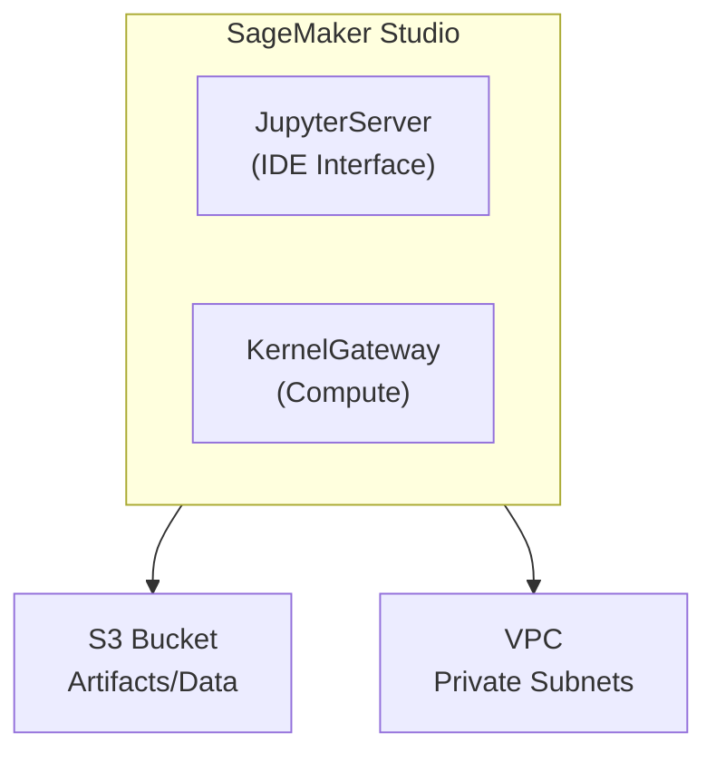

# SageMaker Studio Lab

## Overview

This hands-on lab sets up a complete SageMaker Studio environment for machine learning development. You'll create a Studio Domain, configure user profiles, and explore the integrated development environment that serves as the foundation for all SageMaker operations.

**Difficulty:** Beginner
**Estimated Time:** 30-45 minutes
**Estimated Cost:** ~$0.00/hour when idle (charges apply when launching notebooks/apps)

## Learning Objectives

By completing this lab, you will:

1. Create and configure a SageMaker Studio Domain
2. Set up IAM roles for SageMaker execution
3. Configure VPC networking for secure ML environments
4. Navigate the Studio IDE interface
5. Create and manage Jupyter notebooks
6. Understand Studio app types (JupyterServer, KernelGateway)

## Architecture



## Prerequisites

- AWS Account with administrative access
- AWS CLI configured
- Node.js and pnpm installed

## Cost Breakdown

| Resource | Cost (approx.) |
|----------|---------------|
| Studio Domain | Free when idle |
| JupyterServer App | ~$0.05/hour (ml.t3.medium) |
| KernelGateway App | Varies by instance type |
| NAT Gateway | $0.045/hour |
| S3 Storage | ~$0.023/GB/month |
| **Total (idle)** | **~$0.05/hour** |

**Important:** Shut down Studio apps when not in use to minimize costs!

## Deployment

### Step 1: Deploy the Infrastructure

```bash
pnpm cdk:deploy lab-sagemaker-studio
```

Deployment takes approximately 10-15 minutes.

### Step 2: Access SageMaker Studio

1. Open the AWS Console and navigate to SageMaker
2. Click on "Studio" in the left navigation
3. Select the user profile created by the lab
4. Click "Open Studio"

## Lab Exercises

### Exercise 1: Explore Studio Interface

**Objective:** Familiarize yourself with the Studio IDE

1. Navigate through the left sidebar:
   - File Browser
   - Running Terminals and Kernels
   - Git integration
   - SageMaker Resources

2. Explore the Launcher:
   - Notebook options
   - Console applications
   - System terminal

### Exercise 2: Create Your First Notebook

**Objective:** Create and run a Jupyter notebook

1. Click "File" > "New" > "Notebook"
2. Select a kernel (Python 3 Data Science)
3. Write a simple Python script:
   ```python
   import sagemaker
   print(f"SageMaker SDK version: {sagemaker.__version__}")
   print(f"Region: {sagemaker.Session().boto_region_name}")
   ```

### Exercise 3: Explore SageMaker Resources

**Objective:** Navigate SageMaker components from Studio

1. Click the SageMaker icon in the left sidebar
2. Explore each category:
   - Experiments
   - Model Registry
   - Endpoints
   - Feature Store
   - Pipelines

### Exercise 4: IAM Role Examination

**Objective:** Understand SageMaker execution roles

1. Open the IAM console using the provided URL
2. Examine the execution role permissions
3. Identify key policy attachments:
   - AmazonSageMakerFullAccess
   - S3 bucket access
   - CloudWatch logging

## Validation

Verify your understanding by answering:

- [ ] What is the difference between a Studio Domain and User Profile?
- [ ] Why does Studio need a VPC with private subnets?
- [ ] What IAM permissions are required for SageMaker training?
- [ ] How do you shut down a running notebook to save costs?

## Cleanup

**Important:** Destroy resources to avoid charges!

1. First, shut down any running Studio apps
2. Then run:

```bash
pnpm cdk:destroy lab-sagemaker-studio
```

## Related Exam Topics

This lab covers MLA-C01 exam topics:

- **Domain 1:** Data preparation infrastructure
- **Domain 2:** Model development environment
- **Task 2.1:** Configure SageMaker development environments

## Related Study Content

- [SageMaker Studio Overview](/mla-c01/study/domain-2-model-development/model-training)
- [IAM for Machine Learning](/mla-c01/study/domain-4-monitoring-security/ml-security)

## Learn More

- [Amazon SageMaker Studio Documentation](https://docs.aws.amazon.com/sagemaker/latest/dg/studio.html)
- [SageMaker Studio Architecture](https://docs.aws.amazon.com/sagemaker/latest/dg/studio-notebooks.html)
- [IAM Roles for SageMaker](https://docs.aws.amazon.com/sagemaker/latest/dg/sagemaker-roles.html)

---

**Lab ID:** lab-sagemaker-studio
**Version:** 1.0.0
**Last Updated:** 2026-01-14
