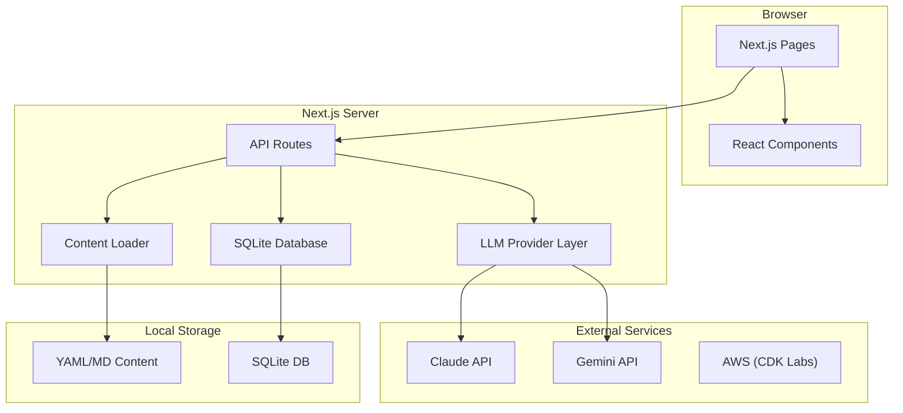
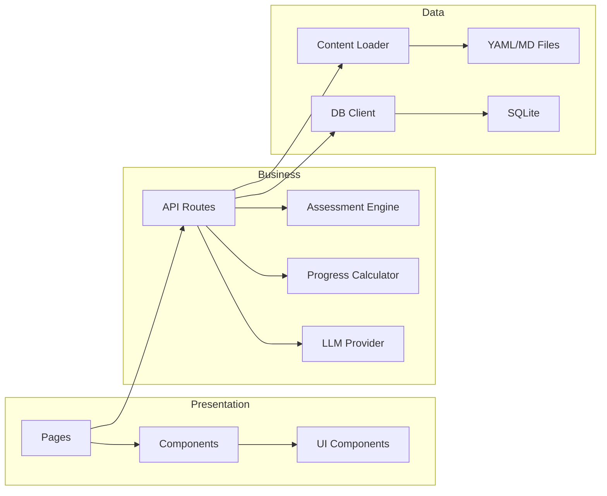
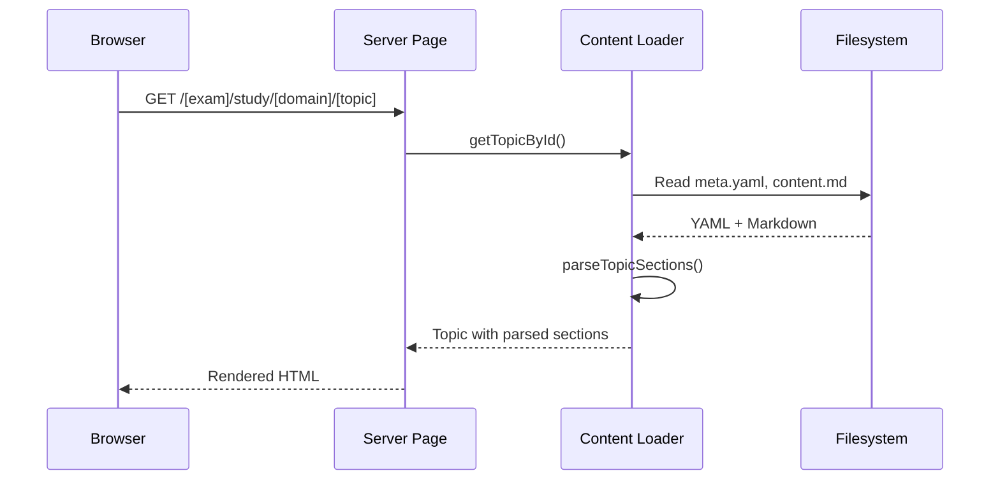
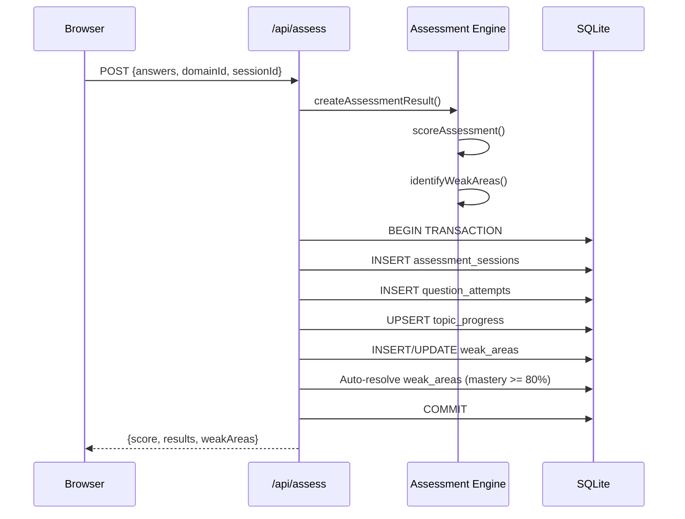
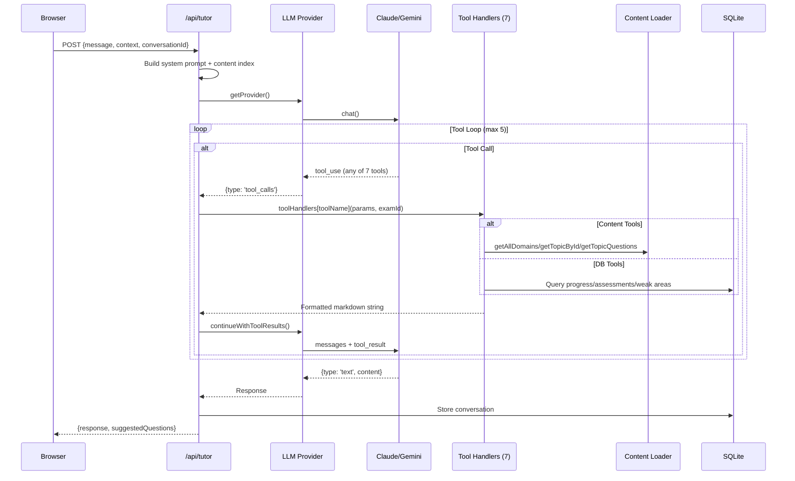

# Codebase Map

> Auto-generated by Cartographer. Last mapped: 2026-01-22

## System Overview

AWS certification study application supporting SAP-C02 (Solutions Architect Professional) and MLA-C01 (Machine Learning Engineer Associate) exams. Features adaptive assessments, AI tutoring via multi-provider LLM abstraction (Claude/Gemini), curated study content with AWS documentation links, and 19 hands-on CDK labs.



## Architecture Layers



## Directory Structure

```
sa-pro-study-companion/
├── src/
│   ├── app/                      # Next.js App Router
│   │   ├── [exam]/               # Exam-scoped routes
│   │   │   ├── assess/           # Assessment pages
│   │   │   ├── experiments/      # Lab detail pages
│   │   │   ├── labs/             # Labs listing
│   │   │   ├── progress/         # Progress dashboard
│   │   │   └── study/            # Study content pages
│   │   └── api/                  # API endpoints
│   │       ├── assess/           # Assessment submission
│   │       ├── progress/         # Progress data
│   │       ├── questions/        # Question fetching
│   │       └── tutor/            # AI tutor chat + provider info
│   ├── components/
│   │   ├── assess/               # Quiz components
│   │   ├── dashboard/            # Dashboard widgets
│   │   ├── experiments/          # Lab components (CopyButton)
│   │   ├── layout/               # App shell (Sidebar, Header)
│   │   ├── progress/             # Charts and stats
│   │   ├── providers/            # Theme provider
│   │   ├── study/                # Content rendering
│   │   ├── tutor/                # AI chat panel
│   │   └── ui/                   # shadcn/ui primitives (19)
│   ├── contexts/                 # React contexts (Exam, Tutor)
│   ├── hooks/                    # Custom hooks (useTutor, useSidebarState)
│   ├── lib/
│   │   ├── assess/               # Scoring engine + tests
│   │   ├── content/              # Content loading/parsing/indexing
│   │   ├── dashboard/            # Tips system
│   │   ├── db/                   # SQLite client + migrations
│   │   ├── llm/                  # Multi-provider LLM abstraction
│   │   │   └── providers/        # Claude and Gemini implementations
│   │   ├── progress/             # Progress calculation
│   │   ├── syntax/               # Shiki syntax highlighting
│   │   └── utils/                # Mastery display, domain colors
│   └── types/                    # TypeScript definitions
├── content/
│   ├── exams/                    # Study content by exam
│   │   ├── mla-c01/              # ML Engineer Associate (4 domains, 16 topics)
│   │   └── sap-c02/              # Solutions Architect Pro (4 domains, 21 topics)
│   └── experiments/              # Lab README guides
│       ├── lab-*/                # SAP-C02 labs (7)
│       └── mla-c01/lab-*/        # MLA-C01 labs (12)
├── cdk/                          # AWS CDK infrastructure
│   ├── bin/                      # CDK app entry
│   └── lib/stacks/               # Lab stack definitions (19)
├── scripts/                      # Utility scripts
├── public/content/experiments/   # Public lab code previews
└── data/                         # SQLite database file
```

## Module Guide

### Pages (`src/app/`)

**Entry point**: `src/app/page.tsx`
**Purpose**: Next.js App Router pages with server and client components

| Route | File | Type | Purpose |
|-------|------|------|---------|
| `/` | `page.tsx` | Server | Exam picker - lists available exams |
| `/[exam]` | `[exam]/page.tsx` | Server | Dashboard with progress overview |
| `/[exam]/study` | `study/page.tsx` | Server | Domain listing |
| `/[exam]/study/[domain]` | `[domain]/page.tsx` | Server | Domain overview with topics |
| `/[exam]/study/[domain]/[topic]/[[...section]]` | `[[...section]]/page.tsx` | Server | Topic content with section navigation |
| `/[exam]/assess` | `assess/page.tsx` | Server | Assessment home with stats |
| `/[exam]/assess/[domain]` | `[domain]/page.tsx` | Mixed | Interactive quiz (AssessmentClient) |
| `/[exam]/progress` | `progress/page.tsx` | Server | Full progress dashboard with charts |
| `/[exam]/labs` | `labs/page.tsx` | Server | Labs listing (exam-aware) |
| `/[exam]/experiments/[lab]` | `[lab]/page.tsx` | Server | Lab detail with CDK code |

**Key patterns**:
- Async params: `const { param } = await params;` (Next.js 14+)
- Server components by default; `'use client'` only for interactivity
- `notFound()` for invalid routes
- Content loaded from filesystem, not database
- Exam context provided via layout with `ExamProvider`
- `TutorProvider` nested in `AppLayout` for page-level tutor access

**Route navigation**:
- Topic pages auto-redirect to first section if no section specified
- `/[topic]/questions` shows practice questions
- Breadcrumb navigation in study pages

---

### API Routes (`src/app/api/`)

| Endpoint | Method | Purpose |
|----------|--------|---------|
| `/api/assess` | POST | Submit assessment, grade answers, store results |
| `/api/progress` | GET | Get progress summary for exam |
| `/api/questions` | GET | Fetch questions (domain or topic-specific) |
| `/api/tutor` | POST | AI chat with 7-tool support and conversation persistence |
| `/api/tutor/provider` | GET | Get current LLM provider and model info |

**Key patterns**:
- Synchronous SQLite queries (`db.prepare().run/get/all`)
- Question metadata injected at load time (domainId, topicId)
- Tutor API handles tool loop (max 5 iterations)
- Conversation persistence in `tutor_conversations` table
- Multi-provider LLM support via `getProvider()`

**Assessment API details**:
- Transaction-wrapped database writes
- Auto-resolves weak areas when mastery >= 80%
- Upsert pattern for topic progress
- Individual question timing tracked

---

### Components (`src/components/`)

#### Layout Components
| Component | Type | Purpose |
|-----------|------|---------|
| `AppLayout` | Client | Root wrapper with sidebar, header, tutor panel |
| `Sidebar` | Client | Desktop navigation (fixed, lg+ only) |
| `MobileSidebar` | Client | Mobile navigation (Sheet drawer) |
| `SidebarContent` | Client | Shared navigation content |
| `Header` | Client | Sticky header with mobile menu |
| `StudyTreeNav` | Client | Collapsible study content tree |

#### Feature Components
| Component | Type | Purpose |
|-----------|------|---------|
| `QuestionCard` | Client | Quiz question with single/multi-select |
| `DashboardHero` | Server | Main dashboard header with adaptive CTA |
| `DomainProgressGrid` | Server | Domain cards with progress bars |
| `WeakAreasSummary` | Server | Top 3 weak areas with study links |
| `TipCard` | Client | Random study tips with refresh |
| `TutorPanel` | Client | AI chat slide-out panel |
| `StudyContent` | Server | Markdown renderer (basic) |
| `StudyContentWithTutor` | Client | Markdown with AI tutor buttons on headings |
| `HeadingWithTutor` | Client | H2/H3/H4 with inline tutor buttons |
| `CodeBlock` | Client | Syntax-highlighted code with copy |
| `MermaidDiagram` | Client | Mermaid diagram renderer |
| `DomainRadarChart` | Client | Recharts radar visualization |
| `DomainBarChart` | Client | Recharts bar visualization |
| `StudyStreak` | Client | Recent activity timeline |
| `WeakAreasList` | Client | All weak areas with study links |
| `ProgressIndicator` | Client | Color-coded progress bar |

**UI Components**: 19 shadcn/ui primitives (Button, Card, Dialog, Sheet, Select, Checkbox, RadioGroup, etc.)

**Key patterns**:
- Server components for static content
- Client components for interactivity and hooks
- Memoization for markdown component rendering
- Singleton Shiki highlighter for syntax highlighting
- Hydration-safe state initialization (mounted checks)
- Dynamic imports with SSR disabled for browser-only components

---

### Library (`src/lib/`)

#### Assessment Engine (`src/lib/assess/`)
| Export | Purpose |
|--------|---------|
| `isAnswerCorrect()` | Validate single/multi-select answers |
| `scoreAssessment()` | Score completed assessments |
| `calculateScore()` | Overall percentage score |
| `identifyWeakAreas()` | Find topics below 60% threshold |
| `generateRecommendations()` | Suggest review topics and labs |
| `createAssessmentResult()` | Build complete result object |

**Gotchas**: Multi-select requires EXACT match (same length + all correct)

#### LLM Provider Abstraction (`src/lib/llm/`)
| Export | Purpose |
|--------|---------|
| `getProvider()` | Get configured LLM provider (cached) |
| `getProviderName()` | Get current provider name |
| `claudeProvider` | Claude API implementation |
| `geminiProvider` | Gemini API implementation |
| `withRetry()` | Exponential backoff retry wrapper |
| `TUTOR_TOOLS` | Tool definitions for tutor (7 tools) |
| `buildTutorSystemPrompt()` | Exam-specific tutor prompt |
| `buildContextPrompt()` | Context section from user location |

#### Tutor Tool Handlers (`src/lib/llm/tool-handlers.ts`)
| Export | Purpose |
|--------|---------|
| `handleGetStudyProgress()` | Returns formatted progress summary via progress calculator |
| `handleGetQuestionDetails()` | Looks up question by ID, returns answer/explanation/doc link |
| `handleSearchStudyContent()` | Keyword search across topic names, services, concepts |
| `handleGetTopicMetadata()` | Returns topic difficulty, study time, docs, related labs |
| `handleGetAssessmentHistory()` | Queries recent assessment sessions and missed questions |
| `handleGetWeakAreaQuestions()` | Returns questions sorted by miss rate from DB |
| `handleSuggestNextStudyTopic()` | Prioritized recommendations based on progress + domain weights |

**Dispatch**: Route uses a `Record<string, ToolHandler>` map - tool name maps to handler function. Each handler is a pure function: `(params, examId) => string`.

**Provider selection**: Via `LLM_PROVIDER` env var (defaults to 'claude')

**Gotchas**:
- Tool call IDs generated for Gemini (doesn't provide them)
- Retry only for `LLMError` with `isRetryable: true`
- Max delay capped at 60 seconds
- Content tools call `loader.ts` (filesystem); progress tools query SQLite directly

#### Content Loading (`src/lib/content/`)
| Export | Purpose |
|--------|---------|
| `getAllDomains()` | Load all domains for exam |
| `getDomainById()` | Load specific domain with topics |
| `getTopicById()` | Load topic with content and questions |
| `getTopicQuestions()` | Load questions (injects domainId/topicId) |
| `getRandomDomainQuestions()` | Shuffle questions for assessment |
| `parseTopicSections()` | Split markdown by H2 headings |
| `getSectionBySlug()` | Find section by slug ID |
| `getSidebarHierarchy()` | Build navigation tree (React.cache) |
| `buildContentIndex()` | Service/concept index for tutor |
| `getLabById()` | Load lab with guide and stack code |
| `labExists()` | Check if lab exists |
| `getLabsForExam()` | Get labs filtered by exam |

**Gotchas**:
- Questions inherit domain/topic IDs from directory structure
- Section slugs generated from H2 heading text
- Content index cached per exam in memory

#### Database (`src/lib/db/`)
| Export | Purpose |
|--------|---------|
| `db` | better-sqlite3 instance (sync API) |
| `closeDatabase()` | Close connection for cleanup |
| `runMigrations()` | Apply pending SQL migrations |
| `getMigrationStatus()` | List applied migrations |

**Tables**: topic_progress, question_attempts, assessment_sessions, study_sessions, weak_areas, tutor_conversations, experiment_deployments

**Pragmas**: WAL mode, foreign keys ON, 64MB cache

#### Progress (`src/lib/progress/`)
| Export | Purpose |
|--------|---------|
| `calculateDomainMastery()` | Average mastery for domain |
| `calculateOverallMastery()` | Weighted overall mastery |
| `getDomainProgress()` | Detailed domain stats (cached) |
| `getOverallProgress()` | Overall stats (cached) |
| `getProgressSummary()` | Complete progress object |
| `getReadinessEstimate()` | Exam readiness score |
| `getTutorProgressContext()` | Format progress for AI tutor |

**Gotchas**:
- Mastery stored as 0-1.0, returned as 0-100
- Readiness requires minimum questions (10 * domain count)
- Weak areas limited to 5 per domain

#### Utilities
| Module | Purpose |
|--------|---------|
| `lib/utils.ts` | `cn()` class merger (clsx + tailwind-merge) |
| `lib/utils/mastery.ts` | Mastery labels and colors |
| `lib/utils/domain-colors.ts` | Domain color mapping |
| `lib/syntax/highlighter.ts` | Server-side Shiki highlighting |
| `lib/dashboard/tips.ts` | Context-aware study tips |

---

### Content (`content/`)

**Structure**: `exams/{exam-id}/domains/{domain-id}/topics/{topic-id}/`

| File | Format | Purpose |
|------|--------|---------|
| `exam.yaml` | YAML | Exam config, domain weights, tutor prompt |
| `meta.yaml` | YAML | Domain/topic metadata |
| `overview.md` | Markdown | Domain introduction |
| `content.md` | Markdown | Topic study content |
| `questions.yaml` | YAML | Assessment questions (15+ per topic) |

**Experiments**:
- SAP-C02: `experiments/lab-{id}/README.md` (7 labs)
- MLA-C01: `experiments/mla-c01/lab-{id}/README.md` (12 labs)

**Key constraints**:
- Questions must have domainId/topicId injected at load time
- Domain weights must sum to 100
- All technical claims link to AWS documentation

---

### CDK Infrastructure (`cdk/`)

**Entry**: `cdk/bin/app.ts` - Routes to lab stacks via `-c labId=...` or `LAB_ID` env var

**Base class**: All stacks extend `BaseLabStack` for consistent tagging and outputs

#### SAP-C02 Labs (7)
| Lab | Services | Cost/hr |
|-----|----------|---------|
| `lab-vpc-networking` | VPC, Peering, NAT, Security Groups | ~$0.10 |
| `lab-rds-multi-az` | RDS PostgreSQL, Multi-AZ, Read Replica | ~$0.15 |
| `lab-step-functions` | Step Functions, Lambda, DynamoDB, SNS | ~$0.05 |
| `lab-ecs-fargate` | ECS, Fargate, ALB, Auto-scaling | ~$0.20 |
| `lab-dynamodb-dax` | DynamoDB, DAX cluster, GSI/LSI | ~$0.30 |
| `lab-s3-cloudfront` | S3, CloudFront, OAC | ~$0.05 |
| `lab-lambda-api-gateway` | Lambda (5), API Gateway, DynamoDB | ~$0.01 |

#### MLA-C01 Labs (12)
| Lab | Services | Cost/hr |
|-----|----------|---------|
| `lab-sagemaker-studio` | VPC, Studio Domain, User Profile | ~$0.00 (idle) |
| `lab-feature-store` | S3, Glue, Feature Groups (2) | ~$0.01 |
| `lab-data-wrangler` | S3 with CORS, IAM | ~$0.27 (when running) |
| `lab-glue-etl` | S3 Data Lake, Glue Crawlers, ETL Job | ~$0.44 (when running) |
| `lab-sagemaker-training` | VPC, S3, Training Role | ~$0.05 |
| `lab-hyperparameter-tuning` | S3, Tuning Role | ~$0.05 |
| `lab-sagemaker-autopilot` | S3, Autopilot Role | ~$0.05 |
| `lab-sagemaker-endpoints` | S3, Model Package Group, Endpoint Role | ~$0.12 |
| `lab-batch-transform` | S3, Batch Role | ~$0.05 |
| `lab-sagemaker-pipelines` | S3, Model Package Group, Pipeline Role | ~$0.05 |
| `lab-model-monitor` | S3, SNS Topic, Monitor Role | ~$0.05 |
| `lab-sagemaker-clarify` | S3, Clarify Role | ~$0.12 |

**Key patterns**:
- Auto-tagging: `sap-study-lab`, `auto-cleanup`, `managed-by`, `deployment-timestamp`
- Console URL outputs for all resources
- Cost-optimized (t3.micro, minimal NAT, on-demand)
- `removalPolicy: DESTROY` with `autoDeleteObjects: true`

---

## Data Flow

### Study Content Flow



### Assessment Flow



### AI Tutor Flow



---

## Conventions

### Naming
- **Files**: kebab-case for content (`network-connectivity.md`), PascalCase for components (`QuestionCard.tsx`)
- **Routes**: kebab-case dynamic segments (`[exam]`, `[domain]`)
- **Database**: snake_case tables and columns
- **CSS**: Tailwind utilities, semantic color tokens

### Component Patterns
- Server components by default
- `'use client'` directive only when needed (hooks, browser APIs)
- Props interfaces defined inline or in `types/`
- shadcn/ui for all base UI components
- `useMemo` for markdown component customization
- Mounted state checks for hydration-safe rendering

### Data Access
- **Content**: Server-side filesystem reads (sync)
- **Database**: Synchronous better-sqlite3 API (no async)
- **LLM APIs**: Async in API routes only
- **Caching**: React.cache() for request-level, module-level for persistent

### Styling
- Tailwind CSS with shadcn/ui design tokens
- HSL color variables for theming (CSS variables)
- Progress indicators: green (85%+), amber (60-84%), red (<60%)
- Mobile-first, lg breakpoint (1024px) for desktop
- Dark mode via class-based switching (next-themes)

---

## Gotchas

1. **Database is synchronous only** - better-sqlite3 has no async API; never use `await` with `db.prepare()`

2. **Questions need metadata injection** - `getTopicQuestions()` injects `domainId` and `topicId` from file path; without this, weak area tracking fails

3. **Params must be awaited** - Next.js 14+ pattern: `const { param } = await params;` in all dynamic routes

4. **Topic sections auto-redirect** - `/[topic]` redirects to `/[topic]/[firstSectionId]`; direct topic URL won't render content

5. **Tutor prompt lives in exam.yaml** - Not hardcoded; exam config contains full system prompt

6. **Labs registered in LABS_METADATA** - `labs.ts` has hardcoded registry; MLA-C01 labs have `exam: 'mla-c01'` field

7. **LLM provider selection** - Via `LLM_PROVIDER` env var; API key env var differs by provider

8. **Boolean stored as INTEGER** - SQLite uses 0/1 with CHECK constraints for boolean fields

9. **Mastery scales differ** - Stored as 0-1.0 decimal, displayed as 0-100 percentage

10. **Content navigation index cached in memory** - Per-exam Map cache; persists until server restart

11. **Multi-select answer validation** - Requires EXACT match (same count + all correct IDs)

12. **Weak area auto-resolution** - Topics resolved when mastery reaches 80%

13. **Gemini tool call IDs** - Generated via hash (Gemini doesn't provide them)

14. **Sidebar parses all content upfront** - `getSidebarHierarchy()` reads every topic's content.md; cached per render pass only

---

## Navigation Guide

**To add a new exam**:
1. Create `content/exams/{exam-id}/exam.yaml` with config
2. Add domain folders with `meta.yaml`, `overview.md`
3. Add topic folders with `meta.yaml`, `content.md`, `questions.yaml`
4. Exam auto-discovered on next page load

**To add a new topic**:
1. Create `content/exams/{exam}/domains/{domain}/topics/{topic-id}/`
2. Add `meta.yaml` with examTask reference
3. Add `content.md` with study material (H2 headings become sections)
4. Add `questions.yaml` with 15+ questions
5. Add topic ID to domain's `meta.yaml` topics array

**To add a new lab**:
1. Create CDK stack in `cdk/lib/stacks/lab-{name}.ts` extending `BaseLabStack`
2. Add metadata to `LABS_METADATA` in `src/lib/content/labs.ts`
3. Add README to `content/experiments/lab-{name}/` (or `mla-c01/lab-{name}/`)
4. Wire up in `cdk/bin/app.ts` switch statement
5. Add public preview to `public/content/experiments/lab-{name}/`

**To modify the database schema**:
1. Create new SQL file in `src/lib/db/migrations/` (e.g., `003_add_field.sql`)
2. Run `pnpm db:migrate`
3. Update TypeScript types in `src/lib/db/schema.ts`

**To switch LLM provider**:
1. Set `LLM_PROVIDER=gemini` or `LLM_PROVIDER=claude` in `.env.local`
2. Set appropriate API key (`GOOGLE_AI_API_KEY` or `ANTHROPIC_API_KEY`)
3. Optionally set model override (`GEMINI_MODEL` or `CLAUDE_MODEL`)

**To update the AI tutor**:
1. Modify exam's `tutorPrompt` in `content/exams/{exam}/exam.yaml`
2. Or update `buildContextPrompt()` in `src/lib/llm/prompts.ts`
3. Add new tools: define in `src/lib/llm/tools.ts`, implement handler in `src/lib/llm/tool-handlers.ts`, add to handler map in `src/app/api/tutor/route.ts`

**To add a new component**:
1. Create in appropriate `src/components/` subdirectory
2. Use `'use client'` only if needed (hooks, interactivity)
3. Import shadcn/ui primitives from `@/components/ui/`
4. Follow existing prop patterns and styling conventions

---

## Development Commands

```bash
# Dependencies
pnpm install

# Development
pnpm dev                          # Start dev server

# Database
pnpm db:migrate                   # Apply schema migrations
pnpm db:seed                      # Seed initial content
pnpm db:reset                     # Reset all user progress

# Content
pnpm content:validate [examId]    # Validate YAML/MD files
pnpm content:stats [examId]       # Show content statistics

# Testing
pnpm test                         # Watch mode
pnpm test:run                     # Single run

# AWS Labs
pnpm cdk:deploy <lab-id>          # Deploy specific lab
pnpm cdk:destroy <lab-id>         # Destroy specific lab
pnpm cdk:cleanup                  # List active deployments
```

---

## Key File Paths

| Purpose | Path |
|---------|------|
| Database file | `data/study.db` |
| Main entry | `src/app/page.tsx` |
| Exam config | `content/exams/{exam}/exam.yaml` |
| Study content | `content/exams/{exam}/domains/{domain}/topics/{topic}/content.md` |
| Questions | `content/exams/{exam}/domains/{domain}/topics/{topic}/questions.yaml` |
| Lab stacks | `cdk/lib/stacks/lab-*.ts` |
| Lab metadata | `src/lib/content/labs.ts` |
| LLM providers | `src/lib/llm/providers/` |
| Tool handlers | `src/lib/llm/tool-handlers.ts` |
| Tool definitions | `src/lib/llm/tools.ts` |
| Migrations | `src/lib/db/migrations/*.sql` |
| shadcn/ui config | `components.json` |
| Tailwind config | `tailwind.config.ts` |
| Install script | `install.sh` |
