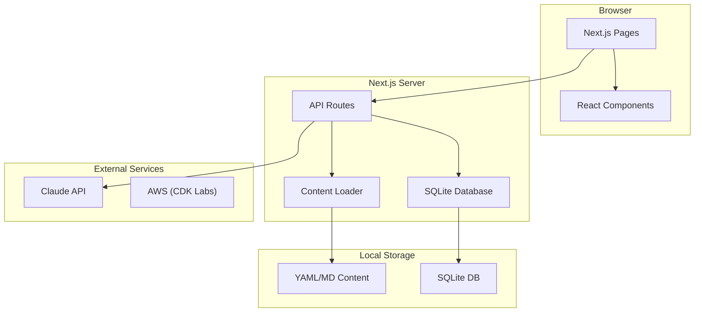
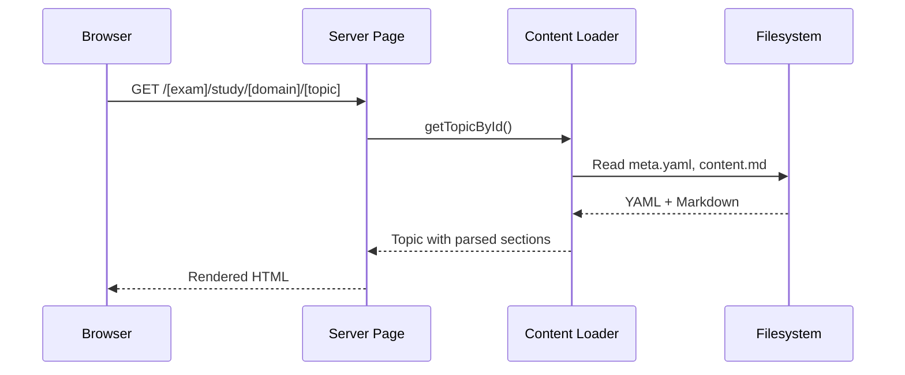
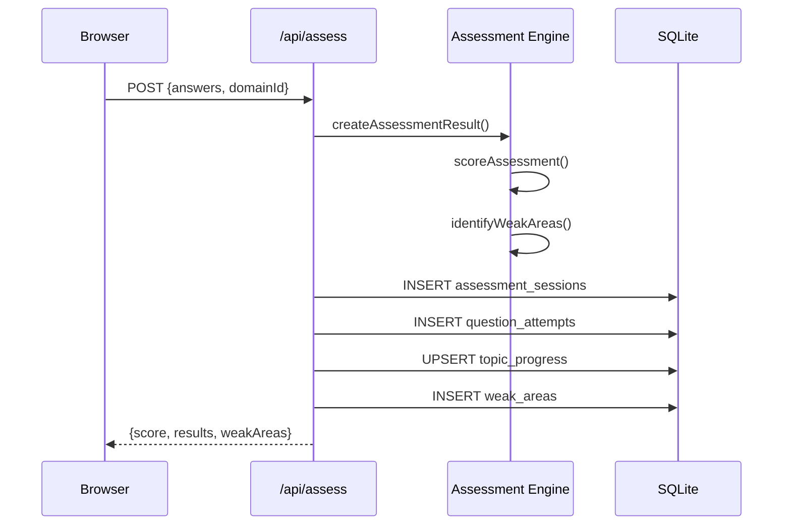
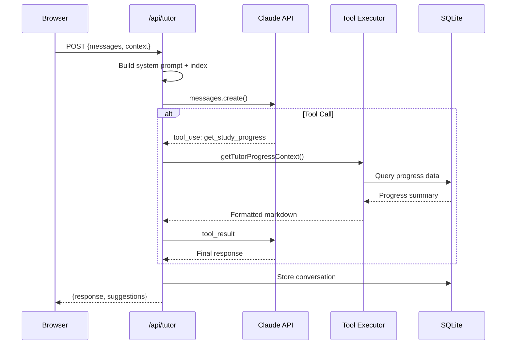

# Codebase Map

> Auto-generated by Cartographer. Last mapped: 2026-01-14

## System Overview

AWS certification study application supporting SAP-C02 (Solutions Architect Professional) and MLA-C01 (Machine Learning Engineer Associate) exams. Features adaptive assessments, AI tutoring via Claude API, curated study content with AWS documentation links, and hands-on CDK labs.



## Architecture Layers


## Directory Structure

```
sa-pro-study-companion/
├── src/
│   ├── app/                      # Next.js App Router
│   │   ├── [exam]/               # Exam-scoped routes
│   │   │   ├── assess/           # Assessment pages
│   │   │   ├── labs/             # Labs listing
│   │   │   ├── progress/         # Progress dashboard
│   │   │   └── study/            # Study content pages
│   │   ├── api/                  # API endpoints
│   │   │   ├── assess/           # Assessment submission
│   │   │   ├── progress/         # Progress data
│   │   │   ├── questions/        # Question fetching
│   │   │   └── tutor/            # AI tutor chat
│   │   └── experiments/          # Lab detail pages
│   ├── components/
│   │   ├── assess/               # Quiz components
│   │   ├── dashboard/            # Dashboard widgets
│   │   ├── layout/               # App shell (Sidebar, Header)
│   │   ├── progress/             # Charts and stats
│   │   ├── study/                # Content rendering
│   │   ├── tutor/                # AI chat panel
│   │   └── ui/                   # shadcn/ui primitives
│   ├── lib/
│   │   ├── assess/               # Scoring engine
│   │   ├── claude/               # Claude API integration
│   │   ├── content/              # Content loading/parsing
│   │   ├── db/                   # SQLite client + migrations
│   │   └── progress/             # Progress calculation
│   ├── contexts/                 # React contexts
│   ├── hooks/                    # Custom hooks
│   └── types/                    # TypeScript definitions
├── content/
│   ├── exams/                    # Study content by exam
│   │   ├── mla-c01/              # ML Engineer Associate
│   │   └── sap-c02/              # Solutions Architect Pro
│   └── experiments/              # Lab README guides
├── cdk/                          # AWS CDK infrastructure
│   ├── bin/                      # CDK app entry
│   └── lib/stacks/               # Lab stack definitions
├── scripts/                      # Utility scripts
├── public/content/experiments/   # Public lab code previews
└── data/                         # SQLite database file
```

## Module Guide

### Pages (`src/app/`)

**Entry point**: `src/app/page.tsx`
**Purpose**: Next.js App Router pages with server and client components

| Route | File | Type | Purpose |
|-------|------|------|---------|
| `/` | `page.tsx` | Server | Exam picker - lists available exams |
| `/[exam]` | `[exam]/page.tsx` | Server | Dashboard with progress overview |
| `/[exam]/study` | `study/page.tsx` | Server | Domain listing |
| `/[exam]/study/[domain]` | `[domain]/page.tsx` | Server | Domain overview with topics |
| `/[exam]/study/[domain]/[topic]/[[...section]]` | `[[...section]]/page.tsx` | Server | Topic content with section navigation |
| `/[exam]/assess` | `assess/page.tsx` | Server | Assessment home with stats |
| `/[exam]/assess/[domain]` | `[domain]/page.tsx` | **Client** | Interactive quiz session |
| `/[exam]/progress` | `progress/page.tsx` | Server | Full progress dashboard |
| `/[exam]/labs` | `labs/page.tsx` | Server | Labs listing (exam-aware) |
| `/experiments/[lab]` | `[lab]/page.tsx` | Server | Lab detail with CDK code |

**Key patterns**:
- Async params: `const { param } = await params;` (Next.js 15)
- Server components by default; `'use client'` only for interactivity
- `notFound()` for invalid routes
- Content loaded from filesystem, not database

**Dependencies**: Content loader, progress calculator, shadcn/ui components

---

### API Routes (`src/app/api/`)

| Endpoint | Method | Purpose |
|----------|--------|---------|
| `/api/assess` | POST | Submit assessment, grade answers, store results |
| `/api/progress` | GET | Get progress summary for exam |
| `/api/questions` | GET | Fetch questions (domain or topic-specific) |
| `/api/tutor` | POST | AI chat with tool support |

**Key patterns**:
- Synchronous SQLite queries (`db.prepare().run/get/all`)
- Question metadata injected at load time (domainId, topicId)
- Tutor API handles tool loop (max 5 iterations)
- Conversation persistence in `tutor_conversations` table

---

### Components (`src/components/`)

#### Layout Components
| Component | Type | Purpose |
|-----------|------|---------|
| `AppLayout` | Client | Root wrapper with sidebar, header, tutor panel |
| `Sidebar` | Client | Desktop navigation (fixed, lg+ only) |
| `MobileSidebar` | Client | Mobile navigation (Sheet drawer) |
| `Header` | Client | Sticky header with mobile menu |
| `StudyTreeNav` | Client | Collapsible study content tree |

#### Feature Components
| Component | Type | Purpose |
|-----------|------|---------|
| `QuestionCard` | Client | Quiz question with single/multi-select |
| `DashboardHero` | Server | Main dashboard header with CTA |
| `DomainProgressGrid` | Server | Domain cards with progress bars |
| `TutorPanel` | Client | AI chat slide-out panel |
| `StudyContent` | Server | Markdown renderer (basic) |
| `StudyContentWithTutor` | Client | Markdown with AI tutor buttons |
| `CodeBlock` | Client | Syntax-highlighted code with copy |

**UI Components**: 19 shadcn/ui primitives (Button, Card, Dialog, Sheet, etc.)

**Key patterns**:
- Server components for static content
- Client components for interactivity and hooks
- Memoization for markdown component rendering
- Singleton Shiki highlighter for syntax highlighting

---

### Library (`src/lib/`)

#### Assessment Engine (`src/lib/assess/`)
| Export | Purpose |
|--------|---------|
| `isAnswerCorrect()` | Validate single/multi-select answers |
| `scoreAssessment()` | Score completed assessments |
| `identifyWeakAreas()` | Find topics below 60% threshold |
| `createAssessmentResult()` | Build complete result object |

#### Claude Integration (`src/lib/claude/`)
| Export | Purpose |
|--------|---------|
| `anthropic` | Configured Anthropic SDK client |
| `CLAUDE_MODEL` | Model ID (claude-sonnet-4-20250514) |
| `buildTutorSystemPrompt()` | Exam-specific tutor prompt |
| `buildContextPrompt()` | Context section from user location |
| `TUTOR_TOOLS` | Tool definitions for function calling |

#### Content Loading (`src/lib/content/`)
| Export | Purpose |
|--------|---------|
| `getAllDomains()` | Load all domains for exam |
| `getTopicById()` | Load topic with content and questions |
| `getRandomDomainQuestions()` | Shuffle questions for assessment |
| `parseTopicSections()` | Split markdown by H2 headings |
| `getSidebarHierarchy()` | Build navigation tree (cached) |
| `buildContentIndex()` | Service/concept index for tutor |

#### Database (`src/lib/db/`)
| Export | Purpose |
|--------|---------|
| `db` | better-sqlite3 instance (sync API) |
| `runMigrations()` | Apply pending SQL migrations |

**Tables**: topic_progress, question_attempts, assessment_sessions, study_sessions, weak_areas, tutor_conversations

#### Progress (`src/lib/progress/`)
| Export | Purpose |
|--------|---------|
| `calculateDomainMastery()` | Average mastery for domain |
| `getProgressSummary()` | Complete progress object |
| `getReadinessEstimate()` | Exam readiness score |
| `getTutorProgressContext()` | Format progress for AI tutor |

---

### Content (`content/`)

**Structure**: `exams/{exam-id}/domains/{domain-id}/topics/{topic-id}/`

| File | Format | Purpose |
|------|--------|---------|
| `exam.yaml` | YAML | Exam config, domain weights, tutor prompt |
| `meta.yaml` | YAML | Domain/topic metadata |
| `overview.md` | Markdown | Domain introduction |
| `content.md` | Markdown | Topic study content |
| `questions.yaml` | YAML | Assessment questions (15+ per topic) |

**Experiments**: `experiments/{lab-id}/README.md` - Lab guides with exercises

**Key constraints**:
- Questions must have domainId/topicId injected at load time
- Domain weights must sum to 100
- All technical claims link to AWS documentation

---

### CDK Infrastructure (`cdk/`)

**Entry**: `cdk/bin/app.ts` - Routes to lab stacks via `-c labId=...`

| Lab | Services | Cost/hr |
|-----|----------|---------|
| `lab-vpc-networking` | VPC, Peering, NAT, Security Groups | ~$0.10 |
| `lab-dynamodb-dax` | DynamoDB, DAX cluster | ~$0.30 |
| `lab-ecs-fargate` | ECS, Fargate, ALB | ~$0.20 |
| `lab-lambda-api-gateway` | Lambda, API Gateway, DynamoDB | ~$0.01 |
| `lab-rds-multi-az` | RDS PostgreSQL, Multi-AZ, Read Replica | ~$0.15 |
| `lab-s3-cloudfront` | S3, CloudFront, OAC | ~$0.05 |
| `lab-step-functions` | Step Functions, Lambda, DynamoDB | ~$0.05 |

**Key patterns**:
- All stacks extend `BaseLabStack`
- Auto-tagging: `sap-study-lab`, `auto-cleanup`
- Console URL outputs for all resources
- Cost-optimized (t3.micro, minimal NAT, on-demand)

---

## Data Flow

### Study Content Flow



### Assessment Flow



### AI Tutor Flow



---

## Conventions

### Naming
- **Files**: kebab-case for content (`network-connectivity.md`), PascalCase for components (`QuestionCard.tsx`)
- **Routes**: kebab-case dynamic segments (`[exam]`, `[domain]`)
- **Database**: snake_case tables and columns

### Component Patterns
- Server components by default
- `'use client'` directive only when needed
- Props interfaces defined inline or in `types/`
- shadcn/ui for all base UI components

### Data Access
- **Content**: Server-side filesystem reads (sync)
- **Database**: Synchronous better-sqlite3 API
- **Claude API**: Async in API routes only

### Styling
- Tailwind CSS with shadcn/ui design tokens
- HSL color variables for theming
- Progress indicators: green (85%+), amber (60-84%), red (<60%)
- Mobile-first, lg breakpoint (1024px) for desktop

---

## Gotchas

1. **Database is synchronous only** - better-sqlite3 has no async API; never use `await` with `db.prepare()`

2. **Questions need metadata injection** - `getTopicQuestions()` injects `domainId` and `topicId` from file path; without this, weak area tracking fails

3. **Params must be awaited** - Next.js 15 pattern: `const { param } = await params;` in all dynamic routes

4. **Sidebar parses all content upfront** - `getSidebarHierarchy()` reads every topic's content.md to extract sections; cached per render pass only

5. **Tutor prompt lives in exam.yaml** - Not hardcoded; exam config contains full system prompt

6. **Labs must be manually registered** - `LABS_METADATA` in `experiments.ts` is hardcoded; no filesystem discovery

7. **Only one lab stack wired** - `cdk/bin/app.ts` switch statement only has `lab-vpc-networking` active

8. **Boolean stored as INTEGER** - SQLite uses 0/1 with CHECK constraints for boolean fields

9. **Mastery scales differ** - Stored as 0-1.0 decimal, displayed as 0-100 percentage

10. **Content navigation index cached forever** - In-memory Map; requires server restart to update

---

## Navigation Guide

**To add a new exam**:
1. Create `content/exams/{exam-id}/exam.yaml` with config
2. Add domain folders with `meta.yaml`, `overview.md`
3. Add topic folders with `meta.yaml`, `content.md`, `questions.yaml`
4. Exam auto-discovered on next page load

**To add a new topic**:
1. Create `content/exams/{exam}/domains/{domain}/topics/{topic-id}/`
2. Add `meta.yaml` with examTask reference
3. Add `content.md` with study material
4. Add `questions.yaml` with 15+ questions
5. Add topic ID to domain's `meta.yaml` topics array

**To add a new lab**:
1. Create CDK stack in `cdk/lib/stacks/lab-{name}.ts`
2. Add to `LABS_METADATA` in `src/lib/content/experiments.ts`
3. Add README to `content/experiments/lab-{name}/`
4. Add public preview to `public/content/experiments/lab-{name}/`
5. Wire up in `cdk/bin/app.ts` switch statement

**To modify the database schema**:
1. Create new SQL file in `src/lib/db/migrations/`
2. Run `pnpm db:migrate`
3. Update TypeScript types in `src/lib/db/schema.ts`

**To update the AI tutor**:
1. Modify exam's `tutorPrompt` in `content/exams/{exam}/exam.yaml`
2. Or update `buildContextPrompt()` in `src/lib/claude/prompts.ts`
3. Add new tools to `TUTOR_TOOLS` in `src/lib/claude/tools.ts`

**To add a new component**:
1. Create in appropriate `src/components/` subdirectory
2. Use `'use client'` only if needed (hooks, interactivity)
3. Import shadcn/ui primitives from `@/components/ui/`
4. Follow existing prop patterns and styling conventions

---

## Key File Paths

| Purpose | Path |
|---------|------|
| Database file | `data/study.db` |
| Main entry | `src/app/page.tsx` |
| Exam config | `content/exams/{exam}/exam.yaml` |
| Study content | `content/exams/{exam}/domains/{domain}/topics/{topic}/content.md` |
| Questions | `content/exams/{exam}/domains/{domain}/topics/{topic}/questions.yaml` |
| Lab stacks | `cdk/lib/stacks/lab-*.ts` |
| Migrations | `src/lib/db/migrations/*.sql` |
| shadcn/ui config | `components.json` |
| Tailwind config | `tailwind.config.ts` |
